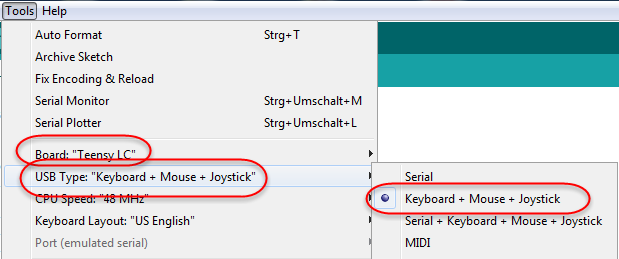

# Turtle
A very very slow Mouse-Emulation ( a Turtle) to prevent Displays from switching off (e.g. presentations)

## Intention
This is intended to be used when doing a presentation or when having a presenter (german: a beamer) connected to a Laptop 
e.g. during a team-meeting.
Often it happens that discussions start and there is no more movement of the mouse and no keys at the Laptop-Keyboard are pressed.
After 5 min or so the Laptop switches off the presenter.
This small device prevents from doing so.

## Realisation
### Hardware
Once more using a "flying around" Teensy-LC.
Once more a "shoot with cannons at sparrows"-project.
No additional Hardware needed

### Software
When connected to USB ( Teensy is started) after a delay of 7 seconds a movement of the mouse left and 
then back right to the original position is done.
This is just to show that Teensy now can act as a Mouse.
After that it only makes invisible 1-pixel-movements every 10 seconds.
Thats it.  
For the teensy to work properly with the turtle-software, the Arduino-IDE has to be set to:
- Teensy
- USB-Type : Keyboard + Mouse + Joystick

See 

### Housing 
To show that this small tool is a turtle it is housed in a "turtle".
I used this one here from Wikimedia:
![Iimage of Turtle] (https://upload.wikimedia.org/wikipedia/commons/7/70/Kturtle_top_view.svg)

See the "making-of" and the final solution on my Blog (in German):
http://jogiblog.kuenstner.de/?p=66

